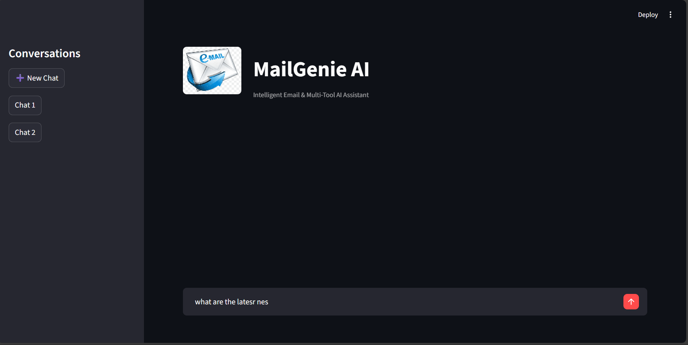

# 📧 MailGenie

MailGenie is a multi-tool agentic chatbot built using LangGraph that intelligently routes user queries across different execution paths including direct LLM responses, real-time web search, and automated email generation and sending.

The system demonstrates practical implementation of tool-augmented AI agents with intelligent routing logic, multi-session memory, and human-in-the-loop workflows that collect missing information step by step before executing actions. It also includes observability and tracing using LangSmith for monitoring and debugging agent behavior.

---

## 🎥 Project Demo

Click the image below to watch the working demo:

[](https://drive.google.com/file/d/1LwjdDvwfWgJyIcQ7xOCZBKdxrj-El4qZ/view?usp=drive_link)


## 🚀 Features

### 🔹 Intelligent Query Routing
- Automatically classifies user queries
- Routes to appropriate execution path:
  - Direct LLM response for general questions
  - Web search for real-time/latest information
  - Email drafting and sending for communication tasks

### 🔹 Email Automation
- Generates structured, formatted email drafts
- Allows editing before sending
- Supports multiple recipients
- Clean JSON-based output parsing

### 🔹 Web Search Integration
- Retrieves up-to-date information
- Enhances responses beyond static model knowledge

### 🔹 Multi-Session Memory
- Thread-based session management
- Each conversation maintains independent state
- Powered by LangGraph checkpointer

### 🔹 Observability & Evaluation
- Integrated with LangSmith for:
  - Full execution tracing
  - Tool invocation inspection
  - Router behavior analysis
  - Debugging and performance monitoring

---

## 🧠 Architecture Overview

User Input  
→ Router Node  
→ Tool Selection (Direct LLM / Web Search / Email Tool)  
→ Response Generation  
→ Memory Update (Thread-based)

The system uses LangGraph to manage state transitions and maintain structured conversation flow.

---

## 🛠 Tech Stack

- **LangGraph** – Agent workflow orchestration
- **LangChain** – LLM integration & tool framework
- **Web Search**- TAVILY SEARCH
- **Groq API** – High-speed LLM inference
- **Streamlit** – Interactive web UI
- **LangSmith** – Tracing and evaluation
- **Python** – Core implementation

---

## ⚙️ Installation & Setup

### 1️⃣ Clone the Repository

```bash
git clone https://github.com/0415-Ak/MailGenie.git
cd AGENTIC_AI_PROJECT
```

### 2️⃣ Create Virtual Environment

```bash
python -m venv venv
venv\Scripts\activate   # Windows
```

### 3️⃣ Install Dependencies

```bash
pip install -r requirements.txt
```

### 4️⃣ Configure Environment Variables

Create a `.env` file in the root directory:

```
GROQ_API_KEY=your_groq_key
LANGCHAIN_API_KEY=your_langsmith_key
LANGCHAIN_TRACING_V2=true
TAVILY_API_KEY=.............
SMTP_EMAIL=Your Email
SMTP_PASSWORD=Your SMTP password
```

---

## ▶️ Running the Application

```bash
streamlit run main2.py
```

The app will open in your browser.

---

## 🎯 Future Improvements

- Automatic chat title generation
- Persistent database-backed memory
- Advanced routing classification
- Dataset-driven automated evaluation
- Deployment with Docker

---

## 👨‍💻 Author

Akshat Jain  
B.Tech Mechanical Engineering, IIT Roorkee  
Interested in AI/ML, Agentic Systems, and LLM Applications

---


